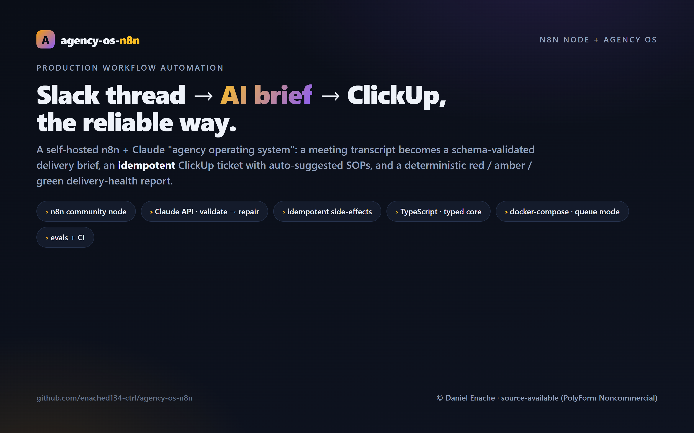
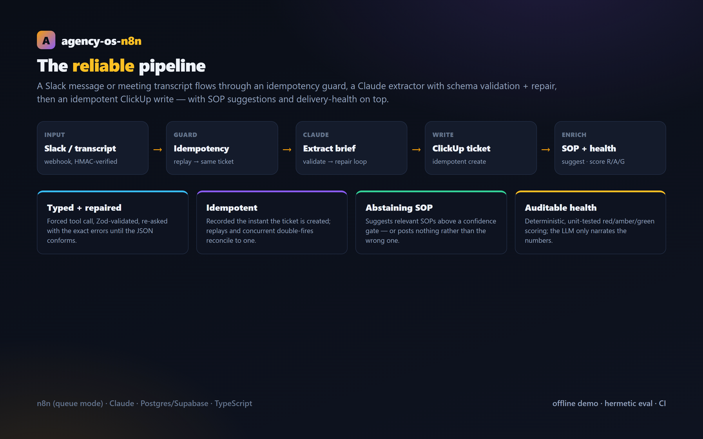
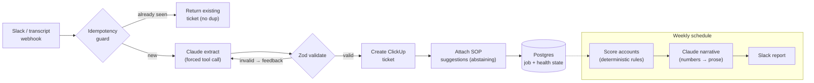
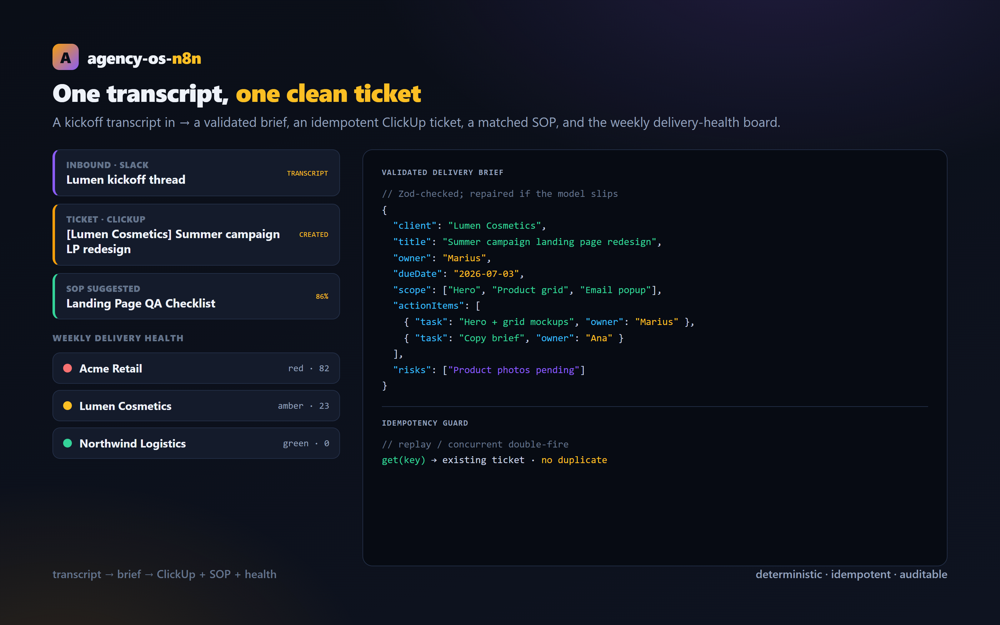

# agency-os-n8n

**A production-grade n8n "agency operating system": turn a Slack thread or meeting transcript into a schema-validated delivery brief, an idempotent ClickUp ticket with SOP suggestions, and a deterministic traffic-light delivery-health report.**

[](https://github.com/enached134-ctrl/agency-os-n8n/actions/workflows/ci.yml)
&nbsp;License: PolyForm Noncommercial 1.0.0 &nbsp;·&nbsp; TypeScript · n8n · Claude · Postgres

> This is **not** a "dump my n8n templates" repo. It's the reliability layer agencies actually lack: typed AI output with a repair loop, idempotent side-effects, an auditable scoring engine, and an offline test/eval suite. The value is in the architecture, not a prompt.



---

## What it does

Small agencies drown in manual ops: meeting notes that never become tickets, SOPs nobody attaches, client health nobody tracks until it's a fire. This wires the glue:

1. **Slack message / meeting transcript → delivery brief.** Claude extracts a *typed* brief (client, owner, due date, scope, action items, risks) — validated against a Zod schema, with a **repair loop** that re-asks the model with the exact validation errors until it conforms.
2. **Brief → ClickUp ticket, idempotently.** A deterministic idempotency key dedupes replayed Slack deliveries and n8n re-runs: the mapping is recorded the instant the ticket is created, and a concurrent double-fire is **reconciled to the first ticket** rather than leaking a duplicate.
3. **SOP suggestions, with a confidence gate.** Relevant SOPs are attached as a comment — and the suggester **abstains** (posts nothing) rather than attach an irrelevant SOP.
4. **Weekly delivery-health.** A **deterministic, unit-tested** rules engine scores each client red/amber/green; Claude only *narrates* the already-computed numbers (the LLM is kept out of the scoring path, so ratings are auditable and reproducible).

## Architecture





## Why it's senior-grade (the hard parts)

| Concern | How it's handled | Where |
| --- | --- | --- |
| LLM returns junk JSON | Forced tool call + **Zod validation + schema-guided repair loop** | [`src/extract.ts`](src/extract.ts) |
| Webhooks fire twice (or race) | **Idempotency key** recorded at create; a concurrent double-fire is reconciled to the first ticket | [`src/idempotency.ts`](src/idempotency.ts), [`src/pipeline.ts`](src/pipeline.ts) |
| Open webhook = paid-API / spam abuse | **Slack HMAC signature check** (+ replay window) before any work | [`workflows/slack-transcript-to-clickup.json`](workflows/slack-transcript-to-clickup.json) |
| Prompt injection via transcript | Transcript **fenced as untrusted data**; model told to ignore embedded instructions | [`src/llm.ts`](src/llm.ts) |
| Wrong SOP erodes trust | Confidence threshold that **abstains** | [`src/sop.ts`](src/sop.ts) |
| "AI rated us amber" is unauditable | Deterministic, **unit-tested** scoring; LLM only narrates | [`src/trafficLight.ts`](src/trafficLight.ts) |
| "Works on my machine once" | **Offline demo + hermetic eval + CI**, no keys needed | [`demo/`](demo), [`evals/`](evals) |

## Quickstart (offline, no keys)



```bash
npm install
npm run demo     # full pipeline on a fixture: brief → ticket → SOPs → idempotent replay → traffic light
npm test         # unit + integration tests
npm run eval     # extraction eval, scored against gold fixtures (CI gate)
npm run build    # compile the library + n8n node
```

The demo and eval run in **replay mode** against recorded Claude responses, so they're fully hermetic. Set `ANTHROPIC_API_KEY` to run extraction against the live model instead — the same eval then scores the live output.

## Run the full n8n stack

```bash
cd infra
cp ../.env.example .env     # fill in ANTHROPIC_API_KEY, CLICKUP_*, SLACK_SIGNING_SECRET
#   set a strong N8N_ENCRYPTION_KEY (required):   openssl rand -hex 24
docker compose up -d        # n8n (queue mode) + worker + Redis + Postgres + Caddy
# open http://localhost:8080
```

Then import the workflows in [`workflows/`](workflows):

- **[slack-transcript-to-clickup.json](workflows/slack-transcript-to-clickup.json)** — webhook → Agency Brief Extractor node → ClickUp.
- **[weekly-delivery-health.json](workflows/weekly-delivery-health.json)** — schedule → read health → Slack report.

> The first workflow uses the bundled community node (`Agency Brief Extractor`, type `n8n-nodes-agency-os.agencyBriefExtractor`). Build it (`npm run build`) and install this package (npm name **`n8n-nodes-agency-os`**) into your n8n instance to enable it; the node + credential are declared in [`package.json`](package.json) under `n8n`. The webhook verifies the Slack request signature, so set `SLACK_SIGNING_SECRET` and never expose the endpoint unauthenticated.

## Project layout

```
src/
  schema.ts        Zod DeliveryBrief + the JSON Schema sent to Claude (kept in sync by a test)
  llm.ts           BriefLLM interface; AnthropicBriefLLM (live) + ReplayBriefLLM (deterministic)
  extract.ts       extractBrief: validate + schema-guided repair loop
  idempotency.ts   idempotency key + store (in-memory / Postgres)
  clickup.ts       ClickUp client (HTTP + dry-run) and brief → markdown
  sop.ts           abstaining SOP suggester
  trafficLight.ts  deterministic, auditable delivery-health scoring
  state.ts         job state machine + health snapshots (Postgres / in-memory)
  pipeline.ts      end-to-end orchestration with the idempotency guard
  nodes/ credentials/   the n8n community node + credential
demo/              offline end-to-end demo
evals/             recorded fixtures + scored extraction eval (CI gate)
tests/             Vitest unit + integration suite
infra/             docker-compose (n8n queue mode), Caddy, Postgres schema + seed
workflows/         importable n8n workflow JSON
```

## License

[PolyForm Noncommercial 1.0.0](LICENSE) — source-available for study and noncommercial use. This is a portfolio/reference system, not a free product to repackage and resell. For commercial use, contact me.

— Daniel Enache · [github.com/enached134-ctrl](https://github.com/enached134-ctrl)
